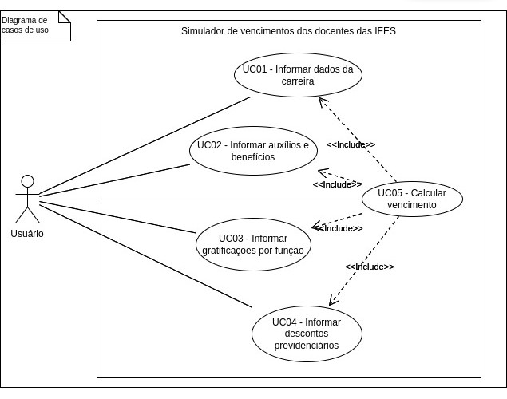

# Requisitos Funcionais do Projeto para um Simulador de Vencimentos para Servidores da Carreira Docente das IFES

Na área de desenvolvimento de software, requisitos funcionais são as especificações das funcionalidades e serviços que uma aplicação deve oferecer. Tais requisitos descrevem o comportamento do sistema em diferentes situações, detalhando as ações que o sistema deve realizar em resposta a entradas específicas [1].

Neste sentido, uma aplicação a ser desenvolvida deve possuir definições claras do que precisa ser implementado. Isso é alcançado por meio da descrição e detalhamento dos requisitos funcionais. A tabela abaixo lista os requisitos funcionais definidos para este projeto, que visa a implementação de um simulador de vencimentos para servidores da carreira docente das IFES. Eles foram originados a partir da análise de uma plataforma já existente que simula salários [*] dos servidores da carreira TAE (Técnico Administrativo em Educação) das IFES, somados à experiência da equipe de participantes do presente projeto.

## Lista de Requisitos Funcionais

| Requisito | Descrição | Caso de Uso |
|-----------|-----------|-------------|
| **RF01 - Informar dados da carreira** | Permitir ao usuário da aplicação informar os dados da carreira docente para o cálculo do vencimento. **Dados a serem informados:** - Versão da tabela de vencimentos (de acordo com a legislação) - Classe (5 opções) - Nível (entre 1 e 4 opções, dependendo da classe) - Regime de trabalho (20h, 40h ou DE) - Nível de retribuição por titulação (aperfeiçoamento, especialização, mestrado ou doutorado) | UC01 - Informar dados da carreira |
| **RF02 - Informar auxílios e benefícios** | Permitir ao usuário da aplicação informar quais auxílios e benefícios compõem o vencimento. **Opções possíveis:** - Auxílio alimentação (metade caso for regime de 20h) - Saúde suplementar (faixa etária do servidor e de cada dependente) - Auxílio pré-escola (quantidade de dependentes) - Auxílio transporte (valor gasto por dia de trabalho) | UC02 - Informar auxílios e benefícios |
| **RF03 - Informar gratificações por função** | Permitir ao usuário da aplicação informar se recebe alguma gratificação por função. **Opções possíveis:** - FCC - FG (nível de 1 a 9) - CD (nível de 1 a 4 e regime de 60% ou 100%) | UC03 - Informar gratificações por função |
| **RF04 - Informar descontos previdenciários** | Permitir ao usuário da aplicação informar os dados previdenciários que compõem o vencimento. **Opções possíveis:** - Regime: RPPS ou RPC - Funpresp (alíquota e/ou valor de contribuição) | UC04 - Informar descontos previdenciários |
| **RF05 - Calcular vencimento** | Calcular o vencimento com base nos dados informados pelo usuário da aplicação nos requisitos RF01, RF02, RF03 e RF04. **Detalhamento:** A aplicação deve detalhar o total de proventos e descontos, especificando o total de vencimento, benefícios, gratificações e descontos previdenciários. | UC05 - Calcular vencimento |

## Diagramas de Casos de Uso e Atividades

Para melhor visualizar a interação do usuário com a aplicação a ser desenvolvida, foi utilizado o diagrama de casos de uso da linguagem UML. Este diagrama, que apresenta uma linguagem simples e de fácil compreensão, é utilizado durante a etapa de levantamento e análise de requisitos do sistema para apresentar uma ideia geral de como uma aplicação irá se comportar. Além disso, o diagrama especifica quem serão os atores (usuários) do sistema e as funcionalidades que serão disponibilizadas para eles [2].

### Figura 1 - Diagrama de Casos de Uso do Projeto

Um diagrama de atividade da UML é um fluxograma que pode ser utilizado para representar as ações executadas por um sistema [3]. Neste sentido, um diagrama deste tipo, exibido na Figura 2, foi desenvolvido para ilustrar quais atividades o sistema a ser desenvolvido executará para ser possível calcular o vencimento dos docentes.

### Figura 2 - Diagrama de Atividades do Projeto

## Referências

[1] SOMMERVILLE, Ian. Engenharia de Software. 10. ed. São Paulo: Pearson Prentice Hall, 2011.

[2] GUEDES, Gilleanes T. A. UML 2: uma abordagem prática. São Paulo: Novatec Editora, 2009.

[3] MILES, R., & HAMILTON, K. Learning UML 2.0. O'Reilly Media, 2019.

[*] Disponível em: [Simulador TAES](https://taes.com.br/)

